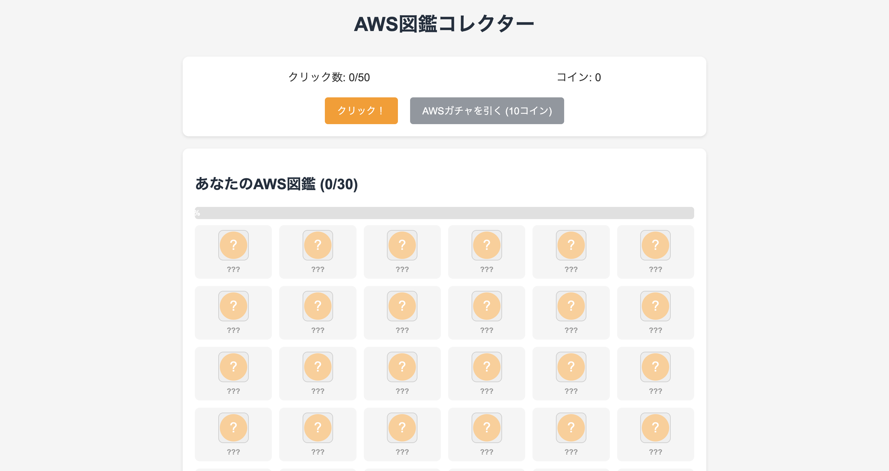

# AWS図鑑コレクター

AWS図鑑コレクターは、AWSサービスについて楽しく学べるシンプルなブラウザゲームです。ボタンをクリックしてコインを集め、AWSサービスのガチャを引いて、自分だけのAWS図鑑を完成させましょう！

## 遊び方

1. 「クリック！」ボタンを50回押すと、10コインを獲得できます
2. 10コインを使って「AWSガチャを引く」ボタンを押すと、ランダムなAWSサービスカードが出現します
3. カードに表示されたAWSサービスの説明を読み、「コレクションに追加」ボタンを押してコレクションに追加します
4. すべての30種類のAWSサービスを集めて、あなただけのAWS図鑑を完成させましょう！

## 特徴

- **30種類のAWSサービス**: EC2、S3、Lambda、DynamoDBなど、様々なAWSサービスを収集できます
- **視覚的なコレクション管理**: 収集したサービスはアイコン付きで表示され、進捗バーで収集率を確認できます
- **学習要素**: 各サービスの簡単な説明が付いているので、AWSサービスについて学びながら遊べます
- **シンプルな操作**: クリックだけの簡単な操作で、誰でも気軽に遊べます

## 収集可能なAWSサービス

以下の30種類のAWSサービスを収集できます：

1. Amazon EC2 - 仮想サーバー
2. Amazon S3 - オブジェクトストレージ
3. Amazon RDS - リレーショナルデータベース
4. AWS Lambda - サーバーレスコンピューティング
5. Amazon DynamoDB - NoSQLデータベース
6. Amazon CloudFront - コンテンツ配信ネットワーク
7. AWS IAM - アクセス管理
8. Amazon VPC - 仮想プライベートクラウド
9. Amazon SNS - 通知サービス
10. Amazon SQS - メッセージキュー
11. Amazon ECS - コンテナオーケストレーション
12. Amazon EKS - マネージドKubernetes
13. AWS Fargate - サーバーレスコンテナ
14. Amazon Aurora - 高性能データベース
15. Amazon Redshift - データウェアハウス
16. Amazon ElastiCache - インメモリキャッシュ
17. Amazon Route 53 - DNSサービス
18. AWS CloudFormation - インフラのコード化
19. Amazon API Gateway - API管理
20. Amazon CloudWatch - モニタリング
21. AWS Step Functions - ワークフロー管理
22. Amazon Cognito - ユーザー認証
23. AWS Glue - ETLサービス
24. Amazon Athena - クエリサービス
25. Amazon Kinesis - ストリーミングデータ
26. AWS Secrets Manager - シークレット管理
27. Amazon SageMaker - 機械学習
28. AWS AppSync - GraphQL API
29. Amazon EventBridge - イベントバス
30. AWS Cloud9 - クラウドIDE

## 技術仕様

- HTML5、CSS3、JavaScript（バニラJS）で開発
- フレームワークを使用せず、シンプルな構造で実装
- SVGアイコンを使用して視覚的に分かりやすく
- レスポンシブデザインで様々なデバイスに対応

## インストール方法

1. リポジトリをクローンまたはダウンロードします
2. `index.html` をブラウザで開きます
3. これだけで遊べます！インターネット接続は不要です

## カスタマイズ

- `script.js` の `awsServices` 配列を編集することで、サービスの追加や変更が可能です
- `images` フォルダにアイコンを追加することで、独自のアイコンを使用できます
- `styles.css` を編集して、ゲームの見た目をカスタマイズできます

## 今後の拡張予定

- レアリティシステムの導入（一般的なサービスから珍しいサービスまで）
- サービスの詳細情報へのリンク追加
- ユーザーの進捗をローカルストレージに保存する機能
- サウンドエフェクトの追加
- 達成バッジシステムの実装

## ライセンス

このプロジェクトはMITライセンスの下で公開されています。

## 作者

AWS図鑑コレクターは、AWSサービスについて楽しく学ぶことを目的として作成されました。

---

楽しくAWSサービスを学びながら、あなただけのAWS図鑑を完成させましょう！
